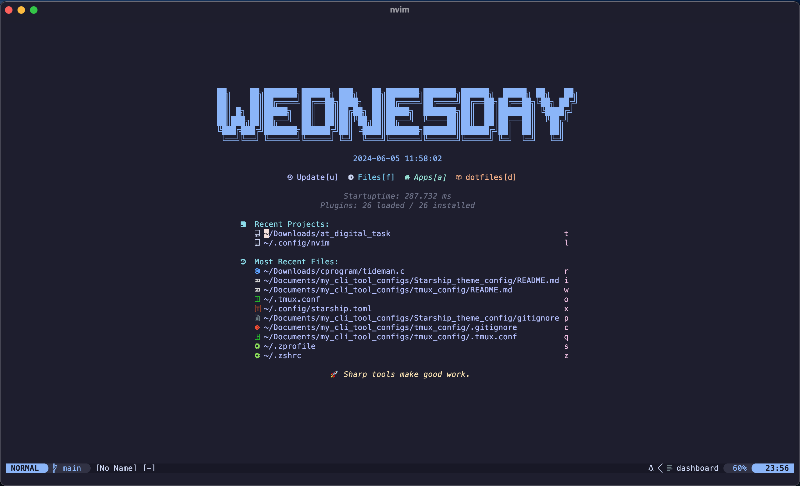
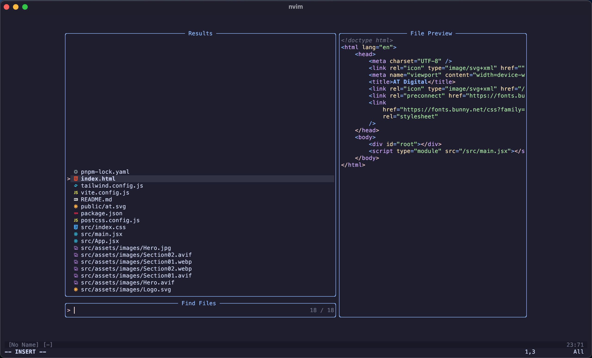
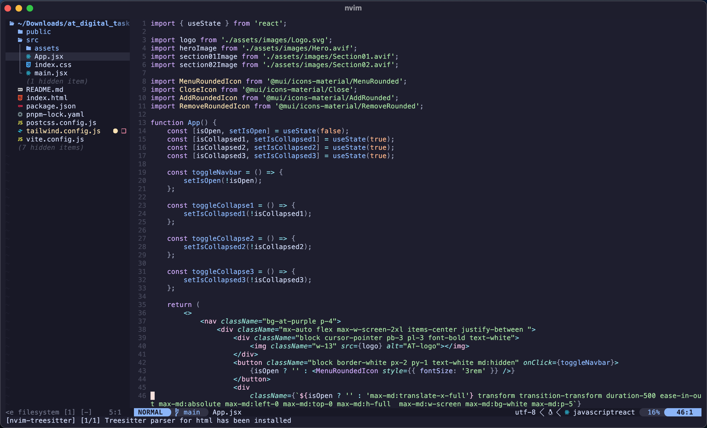
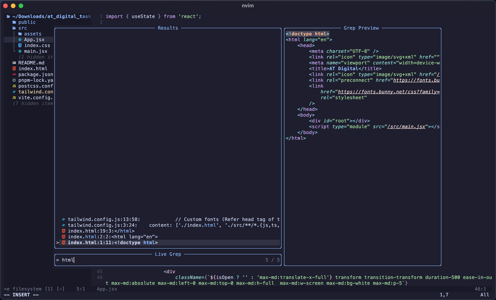
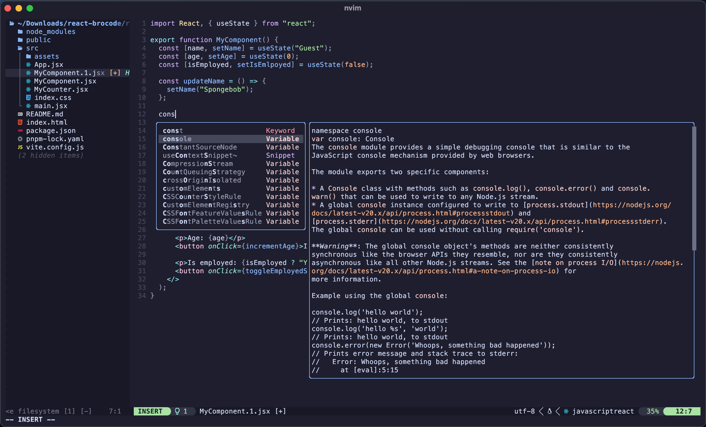

# Lazy neovim config

  
_Welcome Screen_   
  
_Fuzzy Search_   
  
_Code Editor and File Tree Sidebar_   
  
_Live grep_   
  
_LSP (Language Server Protocol)_   

This is my custom config of neovim which is primarily optimized for my workflow but can be configured for any other workflow without a hassle.

## Features configured

-   **Lazy.nvim** - To manage and install all the plugins.
-   **catppuccin theme** - A beatiful dark theme with syntax highight support.
-   **lualine** - A theme for the neovim bottom info bar.
-   **telescope** - for fuzzy searching and greping through files.
-   **treesitter** - for advanced syntax highlighting with automatic language detection.
-   **neo-tree** - A file tree sidebar for easy file management in projects.
-   **lspconfig, None-ls, cmp-nvim-lsp, luasnip and friendly-snippets** - To provide code snippets and suggestions.
-   **nvim-dap and nvim-dap-ui** - for debugging (work in progress) _basic setup has been done_.

## Linting and Formatting support (as of now)

-   Lua
-   JavaScript and TypeScript
-   Python

## Prerequisites

-   Linux, MacOS or Windows system
-   Git installed
-   A true color supported terminal (eg: iTerm2, Alacritty, Kitty and etc.)
-   A Nerd font installed and enabled for your terminal. Get one from here -> https://www.nerdfonts.com/
-   RipGrep - A supporting application for enabling Greping capabilities. (https://github.com/BurntSushi/ripgrep)
-   An internet connection (to let Lazy.nvim to download the plugins)

## How to use this config

1. Install Neovim (if you haven't already).
2. Pull the config from my repo using git.
    - You should put these files in the neovim's default runtime path which is `~/.config/nvim` (Pull the files directly to there or copy/move after downloading).
3. Open neovim using `nvim` command and source the `init.lua` file.
    - You can source the init.lua file by openning that file directly from neovim and running `:Source %` in the neovim command pallete.
4. Now run `:Lazy` in neovim command pallete and lazy.nvim will install all the nessary plugins.

## Custom keymaps

Following are few custom keymaps that I have addded to work with the plugins.

-   **Ctrl + p** - Opens up fuzzy finder overlay
-   **Space + p** - Opens up grep overlay
-   **Space + gf** - Formats the code using the linters and formatters configured using none-ls
-   **Ctrl + n** - Opens up the neo-tree (the file tree sidebar)
-   **Ctrl + b** - scroll up completion suggestions docs
-   **Ctrl + f** - scroll down completion suggestions docs

If you don't have prior experience in Neovim or Vim, view the complete default command list from here -> https://neovim.io/doc/user/vimindex.html

## Credits

-   Neovim
-   catppuccin
-   lualine
-   telescope
-   treesitter
-   neo-tree
-   lspconifg
-   None-ls
-   cmp-nvim-lsp
-   luasnip
-   friendly-snippets
-   nvim-dap
-   nvim-dap-ui
-   Ripgrep
-   MesloLGS NF (Nerd Font)
-   iTerm2

Also huge shoutout to Typecraft youtube channel
 👉 https://www.youtube.com/@typecraft_dev

This config is 90% based on his amazing tutorial on configuring Noevim for newbs. I had to change few stuff along the way due to the changes in my workflow and deprecation of some plugins and dependancies he used back then.

## Thank You ❤️

Thank you for reading till the very end. Happy coding N3RDS!
